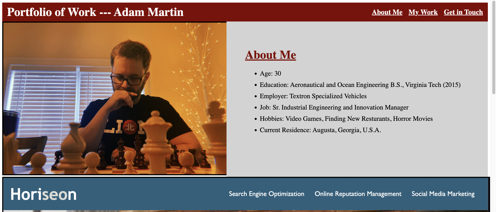
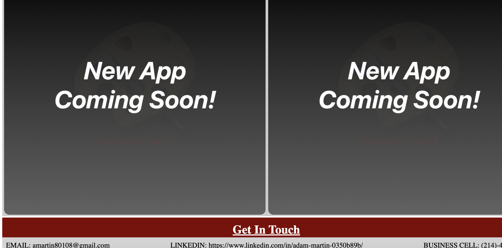

Name: Adam Martin
Project Description: Beginner Portfolio
Due: 05/09/2022

Description: A webpage contraining a portfolio of work. This includes:
    - Functioning links (About Me, Bodies of Work, Contact Me)
    - Profile picture
    - About me section
    - A "featured" app (links to app)
        o Chosen App: Horiseon webpage
    - All other apps below (links to app)
        o Currently contains 2 placeholder apps
    - A footer with contact information
        o Email, Linkedin, Work Phone #

Link to Git Page: https://amartinvt.github.io/Week2Homework/

Link to Git Repo: https://github.com/AmartinVT/Week2Homework

Screenshots of Deployed App:

